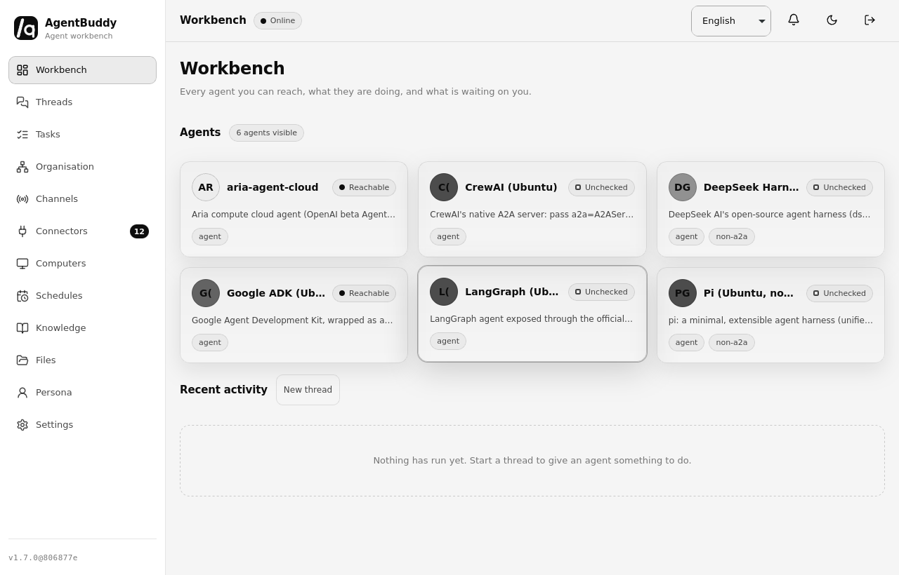
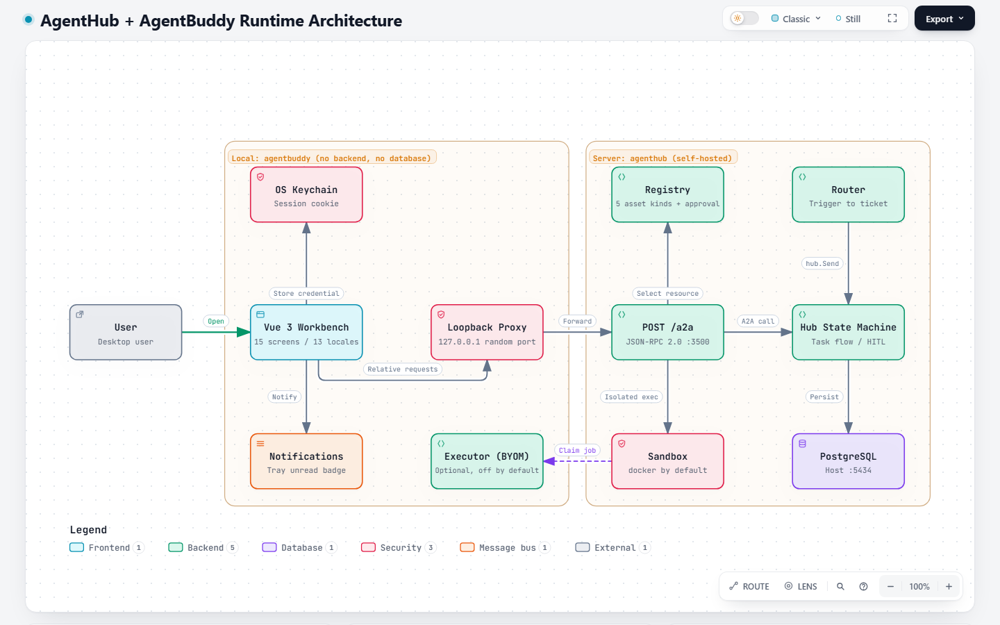

<div align="center">
<a name="readme-top"></a>

# agentbuddy

**A desktop workbench for the agents you can reach**

Point it at any agenthub server: every agent you can ask, every thread you<br/>
follow and every task waiting on you live in one native window.

**English** · [简体中文](./README_cn.md) · [Releases][releases] · [Gitee mirror][gitee] · [Diagrams][diagrams] · [Issues][issues]

[![][badge-release]][releases] [![][badge-ci]][ci] [![][badge-license]][license]
<br/>
[![][badge-platform]][releases] [![][badge-tauri]][tauri] [![][badge-stars]][stars] [![][badge-forks]][forks]
</div>

<details>
<summary><kbd>Table of contents</kbd></summary>

#### TOC

**Get started**

- [✨ Features](#-features)
- [📸 Screenshots](#-screenshots)
- [🗺 Diagrams](#-diagrams)

**Build & ship**

- [⌨️ Develop](#-develop)
- [🧪 Test](#-test)
- [📦 Release](#-release)
  - [✍️ Signed updates (one-time setup)](#-signed-updates-one-time-setup)

**Run & host**

- [🖥 Execution environments](#-execution-environments)
  - [🔌 Serving as an execution node (optional, off by default)](#-serving-as-an-execution-node-optional-off-by-default)

**Compare & governance**

- [⚖️ Comparison](#-comparison)
- [📝 License](#-license)
- [🤝 Engineering conventions](#-engineering-conventions)

</details>

A desktop client for the [agenthub](https://github.com/ariacompute/agenthub) A2A
interconnection platform.

## ✨ Features

- Connect to any agenthub server by URL. The session lives in an HttpOnly cookie
  and is reused by the loopback proxy, so the workbench just talks same-origin.
- Agents, threads (single or multi-select delete with a confirmation, a localised
  back link from every thread to the list, and a confirmed "clear all messages"
  action that keeps the thread and its tasks, in all 13 languages),
  task tracing, approvals (HITL park/resume), channels
  (Slack / Teams / Telegram / SMS webhooks), connectors (policy-gated actions),
  and voice (record → transcribe → delegate).
- Automatic updates: GitHub and Gitee are probed in parallel and the fastest
  reachable mirror wins, with failover to the other. Checks run on startup and
  daily; the signed installer is matched to the local OS/CPU and a one-click
  verified upgrade restarts the app. Automatic checks can be turned off and a
  version skipped in Settings.

<div align="right">

[![][back-to-top]](#readme-top)

</div>

## 📸 Screenshots

The Workbench home screen — every agent you can reach, what they are doing,
and what is waiting on you:



<details>
<summary><kbd>All 15 screens · English / 简体中文</kbd></summary>

| # | Screen | English | 简体中文 |
| --- | --- | --- | --- |
| 01 | Login | [PNG](screenshots/en/01_Login.png) | [PNG](screenshots/zh/01_登录.png) |
| 02 | Workbench | [PNG](screenshots/en/02_Workbench.png) | [PNG](screenshots/zh/02_工作台.png) |
| 03 | Threads | [PNG](screenshots/en/03_Threads.png) | [PNG](screenshots/zh/03_会话.png) |
| 04 | Thread | [PNG](screenshots/en/04_Thread.png) | [PNG](screenshots/zh/04_会话详情.png) |
| 05 | Tasks | [PNG](screenshots/en/05_Tasks.png) | [PNG](screenshots/zh/05_任务.png) |
| 06 | Task | [PNG](screenshots/en/06_Task.png) | [PNG](screenshots/zh/06_任务详情.png) |
| 07 | Organisation | [PNG](screenshots/en/07_Organisation.png) | [PNG](screenshots/zh/07_组织.png) |
| 08 | Channels | [PNG](screenshots/en/08_Channels.png) | [PNG](screenshots/zh/08_通道.png) |
| 09 | Connectors | [PNG](screenshots/en/09_Connectors.png) | [PNG](screenshots/zh/09_连接器.png) |
| 10 | Computers | [PNG](screenshots/en/10_Computers.png) | [PNG](screenshots/zh/10_计算机.png) |
| 11 | Schedules | [PNG](screenshots/en/11_Schedules.png) | [PNG](screenshots/zh/11_目标调度.png) |
| 12 | Knowledge | [PNG](screenshots/en/12_Knowledge.png) | [PNG](screenshots/zh/12_知识库.png) |
| 13 | Files | [PNG](screenshots/en/13_Files.png) | [PNG](screenshots/zh/13_文件.png) |
| 14 | Persona | [PNG](screenshots/en/14_Persona.png) | [PNG](screenshots/zh/14_人格.png) |
| 15 | Settings | [PNG](screenshots/en/15_Settings.png) | [PNG](screenshots/zh/15_设置.png) |

</details>

The captures are generated by `desktop/e2e/shoot.mjs`, which drives the real
desktop client through every route with `tauri-driver` after connecting and
signing in to a live agenthub. See
[Screenshot generation](desktop/e2e/README.md#screenshot-generation-live-mode-only)
for prerequisites and the exact naming rules. The former standalone previews
(`workbench.png`, `workbench_cn.png`, `diagrams/registry_cn.png` and
`diagrams/workbench_cn.png`) have been removed; use `screenshots/` instead.

<div align="right">

[![][back-to-top]](#readme-top)

</div>

## 🗺 Diagrams

Four interactive diagrams cover the runtime architecture, one A2A delegation,
the task state machine, and the resource grants shared by both ends. Each is a
single self-contained HTML file: open it online, or clone the repo and open
`docs/diagrams/` locally with no server.

| Diagram | Interactive | Static preview |
| --- | --- | --- |
| Runtime architecture | [Open](https://ariacompute.github.io/agentbuddy/diagrams/agenthub-agentbuddy.architecture.en.html) | [PNG](diagrams/agenthub-agentbuddy.architecture.en.png) |
| One A2A delegation (`message/send` → `tasks/resume`) | [Open](https://ariacompute.github.io/agentbuddy/diagrams/agenthub-agentbuddy.sequence.en.html) | [PNG](diagrams/agenthub-agentbuddy.sequence.en.png) |
| Task state machine | [Open](https://ariacompute.github.io/agentbuddy/diagrams/agenthub-agentbuddy.lifecycle.en.html) | [PNG](diagrams/agenthub-agentbuddy.lifecycle.en.png) |
| Resource grants | [Open](https://ariacompute.github.io/agentbuddy/diagrams/agenthub-agentbuddy.grants.en.html) | [PNG](diagrams/agenthub-agentbuddy.grants.en.png) |



<div align="right">

[![][back-to-top]](#readme-top)

</div>

## ⌨️ Develop

Prerequisites: [bun](https://bun.sh) 1.4+ and a Rust toolchain (edition 2021).

```bash
make web-dev      # vite dev server on :5173, proxies /api to localhost:3500
make desktop-dev  # run the shell against the freshly built console
make build        # console + a host-platform installer
```

Or build step by step with bun only (no `make`). The Tauri icons are derived
from `desktop/assets/app-icon.png` and live under `desktop/src-tauri/icons/`
(git-ignored build artefacts — see `.gitignore`), so run `bun run icons`
before `tauri build` / `tauri dev`:

```bash
cd web && bun install && bun run build  # build web/dist, embedded into the binary
cd desktop && bun install
bun run icons                           # derive Tauri icons from assets/app-icon.png
bun run build                           # tauri build for the host platform
# bun run dev                           # dev mode also needs `bun run icons` first
```

<div align="right">

[![][back-to-top]](#readme-top)

</div>

## 🧪 Test

```bash
make test                           # web Vitest + release-script Vitest + desktop cargo tests, fully offline
cd web && bun run test              # Vitest: i18n completeness, monochrome guard, lib units
cd web && bun run test:coverage     # same suite, plus a v8 coverage report
cd desktop && bun run test          # release-time scripts: icons, stamp, signing, latest.json
cd desktop && bun run test:coverage # same suite, plus a v8 coverage report over scripts/
cd desktop/src-tauri && cargo test  # proxy / config / i18n units
make smoke                          # both cross-process smoke tests (see below)
```

`make smoke` runs the two tests that talk over a real socket, on `127.0.0.1`
only — nothing leaves the machine:

- `make web-smoke` — the real API client and Pinia store against a `node:http`
  stub: `refreshAll()` reaches every endpoint, the OS-toast POST arrives with a
  localised title, a 401 becomes `authExpired`, and a closed socket becomes
  `offline` (never "session expired").
- `make desktop-smoke` — a real upstream `TcpListener` plus a real `axum::serve`
  proxy driven by a real `reqwest` client: no token → 401, bootstrap nonce →
  Cookie, `/api` forwarded with the upstream `Set-Cookie` rewritten,
  `/__shell/notify` answers with a machine code, foreign `Origin` → 403.

### Desktop application end-to-end tests

`desktop/e2e` drives the **real desktop client** with `tauri-driver` and the
platform's WebDriver, asserting only what a user can see: elements, clicks,
typed text and visible results. It covers the first-run connection page,
sign-in, all 15 workbench screens, 13 languages with light/dark and RTL,
notifications and the tray badge, single-instance recall, update checks, and
the loopback proxy's admission control and forwarding. By default a local
deterministic `node:http` stub stands in for the server; set
`E2E_BACKEND=live` to point the same journeys at a real agenthub:

```bash
make e2e-contract                                       # server contract only, no Rust toolchain or WebDriver
make e2e                                                # build the debug client + full journeys (stub mode)
E2E_SERVER_URL=http://127.0.0.1:3500 \
E2E_LIVE_EMAIL=... E2E_LIVE_PASSWORD=... make e2e-live  # real agenthub
```

See `desktop/e2e/README.md` for prerequisites, environment variables and the
artefacts.

To capture ready-made screenshots of the real desktop client (15 screens × English /
Chinese), see [Screenshot generation](desktop/e2e/README.md#screenshot-generation-live-mode-only)
in `desktop/e2e/README.md`.

#### Windows hosts: from skipped to running

A `↓` next to a suite is a preflight skip, not a failure. The orchestrator
prints the reason and every failing check to the terminal, and writes the full
checklist to `desktop/e2e/artifacts/run.json`. Three prerequisites commonly
fail on Windows, in this order:

- `desktop binary` — `cd desktop && bun run test:e2e` only runs the specs; it
  neither installs the driver nor builds the client. Use `make e2e`, which
  builds `icons` → `web/dist` → the `e2e-isolation` debug binary.
- `tauri-driver` — `make e2e` now installs it idempotently through
  `e2e-tools`; `make e2e-tools` can also be run on its own.
- `msedgedriver` — the platform driver is not installed by any make target.

The last one needs an Edge WebDriver build matching the installed WebView2
Runtime (check `Microsoft Edge` → About, or the `pv` value of
`HKLM\SOFTWARE\WOW6432Node\Microsoft\EdgeUpdate\Clients\{F3017226-FE2A-4295-8BDF-00C3A9A7E4C5}`).
For runtime `157.0.4341.46`, for example:

```bash
curl -LO https://msedgedriver.microsoft.com/157.0.4341.46/edgedriver_win64.zip
unzip edgedriver_win64.zip -d ~/tools      # yields msedgedriver.exe
# download page: https://developer.microsoft.com/en-us/microsoft-edge/tools/webdriver
# full build directory: https://msedgedriver.microsoft.com/catalog/index.html
export E2E_NATIVE_DRIVER='C:/Users/USERNAME/tools/msedgedriver.exe'
make e2e
```

Setting `E2E_NATIVE_DRIVER` matters: preflight also accepts a bare
`msedgedriver` on PATH, but only this variable makes the orchestrator pass
`--native-driver <path>` to tauri-driver. Use Windows-style forward slashes
so MSYS2 does not have to translate a `/c/...` path for a Windows process.
If port 4444 is taken, set `E2E_DRIVER_URL`. A major-version mismatch is not
caught by preflight; the WebDriver session fails later at startup.

The contract specs always run for real, even on a host that cannot launch the
desktop client. WebView2 + msedgedriver on Windows is best effort; Linux CI
remains the authoritative full run.

<div align="right">

[![][back-to-top]](#readme-top)

</div>

## 📦 Release

Publishes installers through [`.github/workflows/release.yml`](.github/workflows/release.yml).
Each release has exactly nine assets: the six downloads below, `latest.json`,
`latest-gitee.json` and `SHA256SUMS`. There is no separate updater archive,
no `.sig` asset and no `updater-*.json` on the release page.

| Platform      | Portable                | Installer        |
| ------------- | ----------------------- | ---------------- |
| Linux x86_64  | `linux-x86_64.tar.gz`   | `amd64.deb`      |
| macOS aarch64 | `macos-aarch64.tar.gz`  | `aarch64.dmg`    |
| Windows x86_64| `windows-x86_64.zip`    | `x64.msi`        |

### ✍️ Signed updates (one-time setup)

```bash
cd desktop
bun install
mkdir -p ~/.tauri
bunx tauri signer generate -w ~/.tauri/agentbuddy.key
```

Enter a password when prompted. The CLI prints the public key and writes
`~/.tauri/agentbuddy.key` (private) and `~/.tauri/agentbuddy.key.pub`. With a
Rust-only toolchain, `cargo install tauri-cli --version '^2' --locked` plus
`cargo tauri signer generate -w ~/.tauri/agentbuddy.key` works as well.

All three values live in repository secrets. Both key files are already
single-line base64 — use their contents verbatim:

```bash
gh secret set UPDATER_PUBKEY < ~/.tauri/agentbuddy.key.pub
gh secret set TAURI_SIGNING_PRIVATE_KEY < ~/.tauri/agentbuddy.key
gh secret set TAURI_SIGNING_PRIVATE_KEY_PASSWORD
```

<div align="right">

[![][back-to-top]](#readme-top)

</div>

## 🖥 Execution environments

The console's **Computers** screen is an execution-environment control plane viewer: the
provider catalogue grouped by isolation layer (container / user-space kernel / microVM /
process / platform / remote / off) with each backend's availability and the reason it is
unavailable, a five-metric water level, lease cards with a countdown, and an audit drawer
with a try-it runner. Everything is read from agenthub — the desktop never probes a runtime
and never decides which backend is safe.

### 🔌 Serving as an execution node (optional, off by default)

Settings → **Execution node** lets this machine run commands for the server, inside limits
the desktop enforces locally:

- **no shell** — the argv is executed directly, and only an exact name from the allow list
  is accepted;
- **one root** — nothing outside the configured absolute directory can be read, written or
  run;
- **bounded** — a timeout kills the whole process group on unix (TERM, a 250ms grace, then
  KILL, so a grandchild cannot outlive the job), output is truncated, and the number of
  concurrent jobs is capped. Windows has no process groups, so it falls back to killing
  the direct child and says so instead of pretending;
- **revocable** — the switch stops the node immediately, and the server shows it offline.

<div align="right">

[![][back-to-top]](#readme-top)

</div>

## ⚖️ Comparison

| Capability | agentbuddy | OpenDots | openmuse | openbot | Octop | openagents | Velozity |
|---|---|---|---|---|---|---|---|
| Form | Tauri v2 desktop + Vue 3 workbench | Web+Mobile template | RN/Expo/Web app | Electron desktop | Self-hosted single process | Agent collaboration OS | Cloud AI Office (SaaS) |
| Backend | agenthub (self-host) | CopilotKit runtime | CopilotKit runtime | Local agent CLIs | Octop Harness | Network SDK (self-host) | Closed cloud |
| Multi-agent | Roles via `persona` (F10) | Specialist Dots | Single personal agent | Many persistent agents | Expert teams + AgentTeams | Any agent in one workspace | User-built AI workforce |
| Computer use | Leased sandbox: docker (default), gVisor, Kata, bubblewrap, hosted runtime or a node you enrolled (F17) | OpenBot container | Playwright browser | Computer Use (cua) | Browser AI+ / remote desktop | Shared browser | Not public |
| Human-in-loop | HITL park/resume (F4) | Approve & save/run | Review before send | Full access (preview) | Tool approval + PII redact | @mention / autonomous | Human + agent collab |
| Scheduling | Trigger router: cron / thread / channel / manual → rules → batched assessor → ticket → worker (F13) | Background turns | Goals & tracking | Webhook routines | Natural-language cron | Channel pickup | Smart scheduling |
| Skills / Knowledge | `kind=skill` + mock RAG (F14) | Auto-learn | — | Local skills | Company Brain | — | Company Brain |
| Channels | Slack / Teams / Telegram / SMS (F6) | Slack | Gmail / Calendar | Desktop / Mobile | IM omnichannel | Workspace threads | Chat + voice cabins |
| Voice | Record → transcribe → delegate (F8) | WebRTC calls | — | Mobile WebRTC | — | — | Voice / video cabins |
| Execution isolation | Server-side leases; this desktop can also serve as a node (BYOM) | — | — | — | — | — | — |
| Self-host | Yes (desktop + agenthub) | Docker | Docker / Render | Local / server | Single process | Self-host network | No (SaaS) |

<div align="right">

[![][back-to-top]](#readme-top)

</div>

## 📝 License

MIT.

<div align="right">

[![][back-to-top]](#readme-top)

</div>

## 🤝 Engineering conventions

This repository follows Harness Engineering:

- [`AGENTS.md`](AGENTS.md): entry point and directory index for agent engineering context
- [`requirements.md`](requirements.md): requirement spec (scope / errors / acceptance, reviewed by a human before coding)
- [`task.md`](task.md): implementation checklist

<div align="right">

[![][back-to-top]](#readme-top)

</div>

---

<div align="center">

Copyright © 2026 [ariacompute][org]. <br/>
This project is [MIT](./LICENSE) licensed.

</div>

<!-- LINK GROUP -->

[org]: https://github.com/ariacompute
[releases]: https://github.com/ariacompute/agentbuddy/releases
[issues]: https://github.com/ariacompute/agentbuddy/issues
[ci]: https://github.com/ariacompute/agentbuddy/actions/workflows/ci.yml
[stars]: https://github.com/ariacompute/agentbuddy/stargazers
[forks]: https://github.com/ariacompute/agentbuddy/network/members
[license]: ./LICENSE
[gitee]: https://gitee.com/ariacompute/agentbuddy
[tauri]: https://tauri.app
[diagrams]: https://ariacompute.github.io/agentbuddy/diagrams/agenthub-agentbuddy.architecture.en.html
[badge-platform]: https://img.shields.io/badge/platform-Linux%20%7C%20macOS%20%7C%20Windows-151515?labelColor=black&style=flat-square
[badge-tauri]: https://img.shields.io/badge/Tauri-v2-151515?labelColor=black&style=flat-square&logo=tauri
[badge-release]: https://img.shields.io/github/v/release/ariacompute/agentbuddy?labelColor=black&style=flat-square
[badge-ci]: https://img.shields.io/github/actions/workflow/status/ariacompute/agentbuddy/ci.yml?labelColor=black&style=flat-square
[badge-license]: https://img.shields.io/github/license/ariacompute/agentbuddy?labelColor=black&style=flat-square
[badge-stars]: https://img.shields.io/github/stars/ariacompute/agentbuddy?labelColor=black&style=flat-square
[badge-forks]: https://img.shields.io/github/forks/ariacompute/agentbuddy?labelColor=black&style=flat-square
[back-to-top]: https://img.shields.io/badge/-BACK_TO_TOP-151515?style=flat-square
